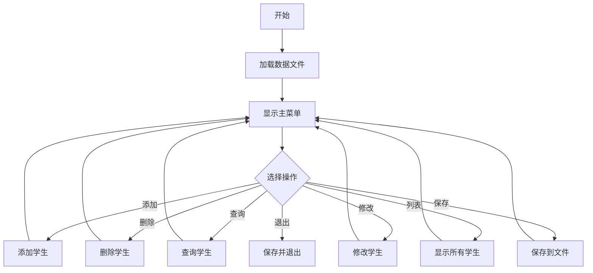

# C语言学生成绩管理系统开发文档

## 项目简介
本项目旨在实现一个简单的学生成绩管理系统，支持学生信息的录入、查询、修改和删除。系统能够将学生数据保存到文件中，实现数据的持久化。该项目主要锻炼C语言的结构体、数组、文件操作等编程基础。

## 功能需求

1. **学生信息管理**
   - 每个学生包含：姓名、学号、成绩（可扩展为多门课程）
   - 支持添加新学生信息
   - 支持删除指定学生信息
   - 支持查询学生信息（按学号、姓名）
   - 支持修改学生信息
   - 列出所有学生信息

2. **文件操作**
   - 学生数据可保存到本地文件（如students.dat或students.txt）
   - 支持从文件加载数据，实现数据持久化

3. **用户交互**
   - 菜单式操作界面
   - 输入输出提示清晰
   - 错误和异常处理（如学号重复、输入非法数据等）

## 技术要求

- 使用结构体定义学生信息
- 用结构体数组存储学生数据
- 用文件读写实现数据存储和恢复
- 最少实现添加、删除、查询、修改、保存、载入等功能
- 代码结构清晰，函数职责单一
- 适当添加注释，提升代码可读性

## 功能模块设计

### 1. 结构体定义

```c
typedef struct {
    char name[50];
    char id[20];
    float score;
} Student;
```

### 2. 主要函数设计

- `void add_student(Student *students, int *count);`  
  添加学生信息

- `void delete_student(Student *students, int *count);`  
  删除学生信息

- `void modify_student(Student *students, int count);`  
  修改学生信息

- `void query_student(Student *students, int count);`  
  查询学生信息

- `void list_students(Student *students, int count);`  
  显示所有学生信息

- `void save_students(Student *students, int count, const char *filename);`  
  保存数据到文件

- `int load_students(Student *students, int *count, const char *filename);`  
  从文件加载数据

- `void menu();`  
  菜单显示与选择

### 3. 主程序流程



### 4. 用户交互示例

```
====== 学生成绩管理系统 ======
1. 添加学生
2. 删除学生
3. 查询学生
4. 修改学生
5. 列出所有学生
6. 保存数据
0. 退出系统
请选择操作: 1

请输入学生姓名: 张三
请输入学生学号: 20230001
请输入学生成绩: 89.5
添加成功！

是否继续操作？(y/n): y
...
```

## 代码规范

- 结构体命名、变量命名规范
- 每个函数添加注释说明
- 适当输入输出提示
- 输入数据校验和异常处理

## 可扩展建议

- 支持多门课程成绩
- 支持学生信息排序（按成绩、学号等）
- 支持导出为csv等格式
- 图形界面（如ncurses库，选做）

---

## 开发建议

建议先实现结构体与数组的基本功能，确保基本操作可用，再完善文件读写和输入校验。最后根据兴趣扩展功能。

---