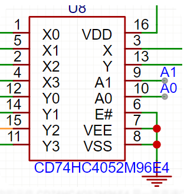

# 芯片笔记：CD74HC4052 双路4通道模拟开关

## 1. 简介

**CD74HC4052** 是一款高速 CMOS 器件，其核心功能是**双路4通道模拟多路复用器/解复用器**。

可以将其理解为两个由数字信号控制的四位选择开关。它能够选择性地接通或断开模拟信号（如传感器电压、音频信号）或数字信号（如 UART、I2C）的通路。由于其双通道特性，非常适合同时切换两路相关的信号。

- **封装:** 图中为 `M96` (TSSOP) 封装
- **逻辑家族:** `HC` (High-Speed CMOS)
- **特点:** 低导通电阻、宽工作电压范围、先开后合（Break-before-make）切换机制。



## 2. 核心功能

* **多路复用 (Multiplexing - MUX):**
    将多路输入信号中的某一路选择性地连接到一个公共输出端。例如，将4个传感器的信号分时连接到一个 ADC 口。

* **解复用 (Demultiplexing - DEMUX):**
    将一个公共输入信号选择性地连接到多个输出端中的某一路。例如，将一个 DAC 的输出分时送给4个不同的执行器。

* **双通道:**
    芯片内部集成了两个独立的4选1通道（X通道和Y通道），它们共享同一组地址选择线 (A0, A1)。这对于切换立体声音频或通信总线（如 `TX/RX`）非常方便。

## 3. 引脚功能

| 引脚号       | 引脚名称    | 类型     | 功能描述                                                     |
| :----------- | :---------- | :------- | :----------------------------------------------------------- |
| 16           | **VDD**     | 电源     | 正电源。通常接 +3.3V 或 +5V。                                |
| 8            | **VSS**     | 电源     | 数字地 (GND)。                                               |
| 7            | **VEE**     | 电源     | 模拟信号的负电源轨。单电源应用时接地；双电源应用时接负电压。信号范围不能超出 `VEE` 到 `VDD`。 |
| 6            | **E#**      | 控制输入 | **使能端 (Enable)**，低电平有效。`LOW` 时芯片工作，`HIGH` 时所有开关断开（高阻态）。 |
| 10           | **A0 (S0)** | 控制输入 | **地址/选择线 0**。与A1共同决定选择哪个通道。                |
| 9            | **A1 (S1)** | 控制输入 | **地址/选择线 1**。与A0共同决定选择哪个通道。                |
| 13           | **Y**       | 公共 I/O | **第一通道 (Y) 的公共输入/输出端**。                         |
| 3            | **X**       | 公共 I/O | **第二通道 (X) 的公共输入/输出端**。                         |
| 14,15,11,(1) | **Y0-Y3**   | 通道 I/O | 第一通道的4个可选输入/输出端。                               |
| 5,2,4,12     | **X0-X3**   | 通道 I/O | 第二通道的4个可选输入/输出端。                               |

> **注意:** TI 官方数据手册中公共端可能标记为 `Z`，通道标记为 `Y`。功能是相同的。

## 4. 工作原理与控制

### 4.1. 供电

* **单电源供电:**
    最常见的用法，处理 `0V` 到 `VDD` 范围的信号。
    - `VDD` -> `+5V`
    - `VSS` -> `GND`
    - `VEE` -> `GND`

* **双电源供电:**
    用于处理跨越 `0V` 的模拟信号（例如 `-5V` 到 `+5V` 的音频信号）。
    - `VDD` -> `+5V`
    - `VSS` -> `GND`
    - `VEE` -> `-5V`

### 4.2. 使能控制

将 `E#` (引脚 6) 连接到 `GND` 以激活芯片。若连接到 `VDD`，所有开关都会断开，X 和 Y 通道均处于高阻态，这在需要将总线完全隔离时很有用。

### 4.3. 通道选择 (真值表)

通过设置 `A1` 和 `A0` 两个数字引脚的电平来选择接通的通道。这两个选择线同时控制 X 和 Y 两个通道。

|   A1   |   A0   | 选通的通道                      |
| :----: | :----: | :------------------------------ |
| `LOW`  | `LOW`  | `Y0` <-> `Y`  并且 `X0` <-> `X` |
| `LOW`  | `HIGH` | `Y1` <-> `Y`  并且 `X1` <-> `X` |
| `HIGH` | `LOW`  | `Y2` <-> `Y`  并且 `X2` <-> `X` |
| `HIGH` | `HIGH` | `Y3` <-> `Y`  并且 `X3` <-> `X` |

## 5. 典型应用场景

### 5.1. 模拟信号多路复用 (扩展 ADC)

这是最常见的应用。当微控制器的模拟输入口 (ADC) 不足时，可以用它来扩展。

**场景:** 用 Arduino 一个 `A0` 口读取4个模拟传感器的值。

- **连接:**
    1.  4个传感器的信号输出分别接到 `Y0`, `Y1`, `Y2`, `Y3`。
    2.  `Y` 引脚接到 Arduino 的 `A0`。
    3.  `A0(S0)` 和 `A1(S1)` 分别接到 Arduino 的数字口（如 `D2`, `D3`）。
    4.  `E#` 和 `VEE` 接地。`VDD` 接 `5V`，`VSS` 接地。

- **示例代码 (Arduino):**
  ```cpp
  // CD74HC4052 控制引脚
  const int S0_PIN = 2; // 连接到芯片 A0 (Pin 10)
  const int S1_PIN = 3; // 连接到芯片 A1 (Pin 9)
  
  // 公共输出引脚
  const int MUX_OUT_PIN = A0; // 连接到芯片 Y (Pin 13)
  
  void setup() {
    Serial.begin(9600);
    pinMode(S0_PIN, OUTPUT);
    pinMode(S1_PIN, OUTPUT);
  }
  
  // 读取指定通道的函数
  int readMuxChannel(byte channel) {
    // 根据通道号设置 S0 和 S1 的电平
    // channel 0: S1=0, S0=0
    // channel 1: S1=0, S0=1
    // channel 2: S1=1, S0=0
    // channel 3: S1=1, S0=1
    digitalWrite(S0_PIN, bitRead(channel, 0)); // A0 = channel 的第0位
    digitalWrite(S1_PIN, bitRead(channel, 1)); // A1 = channel 的第1位
    
    // 短暂延时以确保开关稳定
    delay(1); 
  
    return analogRead(MUX_OUT_PIN);
  }
  
  void loop() {
    for (int i = 0; i < 4; i++) {
      int sensorValue = readMuxChannel(i);
      Serial.print("Sensor on Y");
      Serial.print(i);
      Serial.print(": ");
      Serial.println(sensorValue);
      delay(500);
    }
  }
  ```

### 5.2. 通信总线切换 (UART 扩展)

利用其双通道特性，可以为一个微控制器扩展出多个串口设备。

- **连接:**
    1.  MCU 的 `TX` 接 `Y`，`RX` 接 `X`。
    2.  设备1 的 `RX` 接 `Y0`，`TX` 接 `X0`。
    3.  设备2 的 `RX` 接 `Y1`，`TX` 接 `X1`。
    4.  ...以此类推。
- **控制:** 在与某个设备通信前，通过 `A0`/`A1` 选择对应的通道即可。

### 5.3. 音频信号切换

同样利用双通道，可以切换立体声音频。
- **连接:** 左声道信号通过 Y 通道切换，右声道信号通过 X 通道切换。

## 6. 注意事项

* **信号范围:** 输入到任何通道的信号电压都不能超过 `VEE` 和 `VDD` 的范围，否则可能损坏芯片。
* **导通电阻:** 开关在接通时并不是理想的导线，而是存在一个小的电阻（数十到数百欧姆，具体看数据手册）。对于高精度模拟测量，需要考虑这个电阻带来的压降。
* **带宽:** 该芯片对信号频率有限制，虽然是高速CMOS，但对于非常高频的信号（如几十MHz以上），信号衰减会很明显。请查阅数据手册中的带宽图表。
* **先开后合 (Break-Before-Make):** 在切换通道时，芯片会先断开当前通道，再接通下一个通道，这可以防止不同通道的信号串扰。