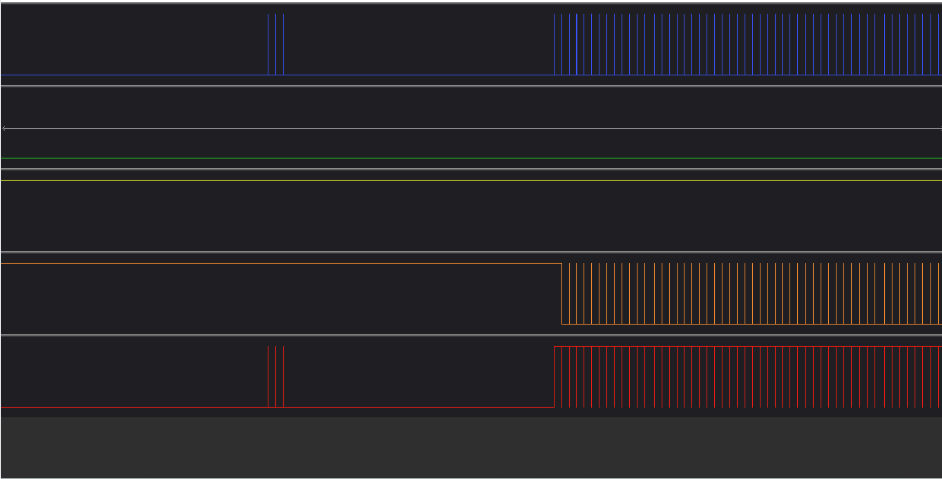
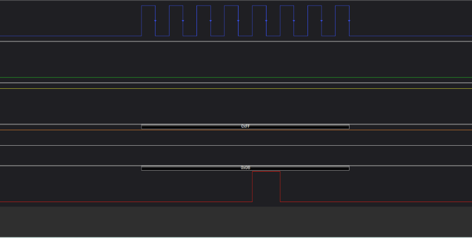

### You said: 我现在遇到的问题是中间那一根黄色的线它代表的是ADS的数据准备脚位，但是它一直没有反应，导致我读不到数据

我现在遇到的问题是中间那一根黄色的线它代表的是ADS的数据准备脚位，但是它一直没有反应，导致我读不到数据


### Copilot said: 你的问题是：**ADS1220的数据准备脚（DRDY，黄色线）一直没有反应，导致无法读取数据。** 结合你之前的寄存器配置和当前的逻辑分析、波形图，下面是详细排查建议： --- ## 1. **确认ADS1220是否开启了转换** - **连续转换模式**需要配置正确，且必须通过“Start/SYNC”命令启动转换。 - 你需要在写完寄存器后，增加一条： ```c

你的问题是：**ADS1220的数据准备脚（DRDY，黄色线）一直没有反应，导致无法读取数据。**

结合你之前的寄存器配置和当前的逻辑分析、波形图，下面是详细排查建议：

------

## 1. **确认ADS1220是否开启了转换**

-   **连续转换模式**需要配置正确，且必须通过“Start/SYNC”命令启动转换。

-   你需要在写完寄存器后，增加一条：

    C

    

    ```
    ADS1220SendByte(ADS1220_CMD_SYNC);
    ```

    或

    C

    

    ```
    ADS1220SendByte(ADS1220_CMD_START); // 某些芯片定义为0x08
    ```

    否则芯片不会开始采样，DRDY永远不会拉低！

------

## 2. **检查SPI通信和片选信号**

-   SPI片选（CS）必须在通信期间拉低。
-   如果SPI通信异常，ADS1220可能没有真正收到命令。
-   你可以通过读取ID寄存器来判断SPI是否正常。

------

## 3. **硬件连线问题**

-   DRDY脚必须**和MCU的输入端口正确连接**，并且不能悬空。
-   建议DRDY引脚外接一个10k下拉电阻，防止空悬。

------

## 4. **寄存器配置和参考电压**

-   你的配置是外部差分参考（REFP0/REFN0），请确认参考电压引脚已正确连接，且电压满足芯片要求。
-   如果参考电压空悬，芯片不会正常工作，DRDY不跳变。

------

## 5. **电源和复位**

-   确认芯片电源、复位、片选信号都正常。
-   复位脚如果一直低电平，芯片也不会工作。

------

## 6. **其他常见原因**

-   芯片上电后必须等待一定时间再初始化。
-   如果你配置了极低采样率，DRDY间隔时间会很长。

------

## 7. **建议调试步骤**

1.  **写完寄存器后，立即下发一次SYNC或START命令。**
2.  **检查SPI信号，确认数据确实被写入。**
3.  **确认外部参考电压和电源正常。**
4.  **用示波器单独测量DRDY引脚，有没有偶发的低脉冲。**
5.  **换用内部参考（如把`ADS1220_VREF_EX_DED`改为`ADS1220_VREF_INT`），排除外部参考问题。**
6.  **换成单次转换模式+手动下发START命令，试试DRDY是否有反应。**

------

## 典型初始化流程

C


```
// 配置寄存器
unsigned char config[4] = {0x81, 0x04, 0x50, 0x00};
ADS1220WriteRegister(0, 4, config);
// 启动转换
ADS1220SendByte(ADS1220_CMD_SYNC); // 或 ADS1220_CMD_START
```

------

## 结论

-   **DRDY一直高电平=没有开始转换或芯片未工作。**
-   优先排查：启动命令、SPI通信、参考电压、硬件连线。

------

如果还有问题，可以上传你的初始化和采样代码片段，我可以帮你详细分析！





### You said: 启动命令正常发送了，CS也是一直拉低的，因为ADS是有两个电源输入，对于SPI通信方面我接入的是对于单片机的3.3v和GND，对于后端采样来说的话，我使用了一个隔离电源，后端采用的都是这个隔离电源后续出来的电压和地

启动命令正常发送了，CS也是一直拉低的，因为ADS是有两个电源输入，对于SPI通信方面我接入的是对于单片机的3.3v和GND，对于后端采样来说的话，我使用了一个隔离电源，后端采用的都是这个隔离电源后续出来的电压和地


### Copilot said: 你的描述和波形图说明了以下关键信息： - **SPI启动命令（0x08）已经正确发送**，CS也是一直拉低。 - **ADS1220有两个电源域**，你用单片机侧3.3V+GND给数字部分，模拟采样侧用隔离电源（隔离后的V+和GND）。 - **DRDY（黄色线）无反应**，即数据准备信号没有跳变。 --- ## 你的硬件系统架构可能存在的问题 ### 1. **数字/模拟地未连通**（最常见原因） -

你的描述和波形图说明了以下关键信息：

-   **SPI启动命令（0x08）已经正确发送**，CS也是一直拉低。
-   **ADS1220有两个电源域**，你用单片机侧3.3V+GND给数字部分，模拟采样侧用隔离电源（隔离后的V+和GND）。
-   **DRDY（黄色线）无反应**，即数据准备信号没有跳变。

------

## 你的硬件系统架构可能存在的问题

### 1. **数字/模拟地未连通**（最常见原因）

-   **ADS1220的数字电源（DVDD/GND）和模拟电源（AVDD/AGND）如果完全隔离，**
    SPI通信虽然正常，但**采样部分不会正常工作**，且参考电压、输入信号与模拟GND之间无法建立电位基准。
-   **DRDY信号输出在数字域，采样在模拟域，地不共参考，DRDY可能一直高电平甚至浮空。**

### 2. **参考电压问题**

-   你的寄存器设置用的是“**外部差分参考**”，如果REFP/REFN引脚没有可靠的参考输入或地参考不对，转换不会开始，DRDY不动作。

### 3. **信号电平不兼容/悬空**

-   DRDY输出为数字域信号，主控的GND必须和ADS1220数字GND共地，否则IO电平不正确。

------

## 解决办法建议

### **A. 检查数字地/模拟地连接原则**

-   **SPI的GND、DVDD和主控MCU的GND必须严格共地。**
-   **DRDY线的下拉和输入端也必须严格和MCU共地。**
-   模拟端AVDD/AGND允许隔离，但
    -   若要测量单端/差分信号，**采样信号源的地必须和模地AGND一致。**
    -   外部参考REFP/REFN也要和AVDD/AGND建立基准。

>   简单说：
>   **SPI和DRDY信号的地==MCU的地==ADS1220数字地**
>   **模拟端地（AGND）可以通过隔离电源与数字地隔离，但如果完全不连，容易出问题。**

------

### **B. 测试方法**

1.  **用万用表测量ADS1220的数字GND、模拟GND、MCU GND是否有电位差。**
2.  **临时用一根跳线短接数字GND和模拟GND，看DRDY是否恢复正常。**
3.  **参考电压引脚REFP/REFN用万用表测实际电压，看是否可靠。**
4.  **把外部参考改为内部参考，尝试配置`ADS1220_VREF_INT`，先排除外部参考问题。**

------

### **C. 建议的调试步骤**

1.  **确保至少在测试时数字/模拟GND短接，确认功能正常后再考虑隔离设计。**
2.  **SPI信号与DRDY信号均用数字地为基准。**
3.  **改为内部参考测试，确认ADS1220可以出数据。**
4.  **如要用隔离，建议用数字隔离芯片（如ADuM系列），让两侧逻辑真正解耦。**

------

## 关键结论

-   **你遇到的DRDY无反应，99%是因为数字地/模拟地完全隔离，导致DRDY输出电位无参考、采样无法正常进行。**
-   请先**让MCU的GND、ADS1220的数字GND，以及DRDY输入的GND严格共地**，测试后再考虑隔离设计。